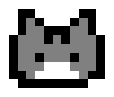

# Mascota virtual de escritorio 🐾

Muestra una mascota animada en el escritorio. 
## *Características* ✨
- Camina de forma aleatoria por toda la pantalla.
- Camina de forma aleatoria únicamente por los bordes de la pantalla.
- Se arrastra con el mouse.
---
## *Distintas mascotas para elegir:* 😺

|               |               |               |
|---------------|---------------|---------------|
| <br>`white_cat` | <br>`orange_cat` | <br>`grey_cat` |
---

## Dependencias 📋
- Para instalar dependencias:
  **Pillow**: `pip install pillow`
  **Tkinter**: 
  Para verificar si y ya está instalado:
  `python -m tkinter` o `python3 -m tkinter`
  Tkinter está incluido en las instalaciones oficiales de Python desde python.org, pero en algunas distribuciones para Linux puede no venir incluido. Ejecutar: `sudo apt-get install python3-tk` o `pip install tk`
---
## *Controles* 🎮
**Clic izquierdo + arrastrar:** Mover mascota
**Clic derecho:** Mostrar menú con opción para cerrar
**Ctrl+C** en terminal: Cerrar todas las mascotas

---
## *Uso* 🚀
Ejecuta el programa desde la terminal:
python mypet.py [opciones]

- *Opciones disponibles*: 

    `-m, --mode`
    - Descripcion: Modo de movimiento
    - Valores permitidos: `random`, `square`
    - Default: `random`
  
    `-q, --quantity`
    - Descripcion: Número de mascotas a crear
    - Valores permitidos: Número entero (un número muy grande puede generar fallos)
    - Default: 1

    `-p, --pet`
    - Descripcion: Tipo de mascota
    - Valores permitidos: varios (ver con `-h, --help`)
    - Default: `white_cat`

*Ejemplo de uso*
```
# Una mascota en modo aleatorio (default)
python mypet.py

# Tres gatos naranjas en modo cuadrado
python mypet.py -m square -q 3 -p orange_cat
```